# Run tuning

Go to WCSimFQTuningTools (pycharm)

Change config.jl

```julia
softdir = "$(ENV["HOME"])/mysps/hk_software/"

fqtunerdir   = "$(softdir)/WCSimFQTuner/cmake-build-debug-cc-in2p3-gcc8"
wcsimdir     = "$(softdir)/WCSim/install-Linux_x86_64-gcc_8-python_3.10.13"
g4dir        = "$(softdir)/Geant4/install-Linux_x86_64-gcc_8-python_3.10.13"
rootdir      = "$(softdir)/ROOT/install-Linux_x86_64-gcc_8-python_3.10.13"
prod_basedir = "$(ENV["HOME"])/mysps/CProfiles/" # change to other names when doing other tuning steps
```

Run (ideally from a screen session)

```bash
cd mysps/hk_software/WCSimFQTuningTools/Simulation/
julia generate_macro_files.jl
julia generate_task_files.jl
julia generate_job_files.jl
julia launch_jobs.jl
```

## Cherenkov profile

```julia
    	 verbose           = true
       nevents_per_task  = 50
       nsubtasks         = 100
       ntasks_per_job    = 10
       base_mac          = abspath("templates/cprofile_base.mac")
       config_mac        = abspath("templates/cprofile_config.mac")
       task_template     = abspath("templates/task_template.sh")
       job_template      = abspath("templates/job_template.sh")

       config_variables  = Dict( "momentum" => range(20, 1000, step=10)
                               , "particle" => ["e-", "mu-"])
```

For this, the `/WCSim/WCgeom Cylinder_12inchHPD_15perCent` is used (this corresponds to the largest water volume defined in WCSim). Since only the light profile is used, the location and number of photo-sensors doesn’t matter.
The lines above will put all the files in the same folder: maybe this is not ideal and it should be changed so that 

Energy range: 50 MeV-1000 MeV (to match TN 146 - Fig 2).

### Check the 2D cherenkov profiles

The cprofile step relies on WCSimFQTuner to produce some 2D histograms with the Cherenkov profiles.

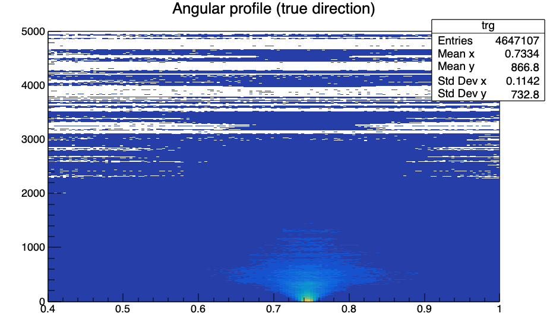

This is for 500 MeV momentum electron for one of the files: this seems to be consistent with TN 146 Fig2.

### Merge produced files

```bash
python ../hk_software/WCSimFQTuningTools/CProfiles/merge_cprofiles_parallel.py out/e- e- wt -v
```

Running the jupyter notebook merging.ipynb

Looks really similar to TN146 Fig2

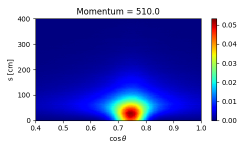

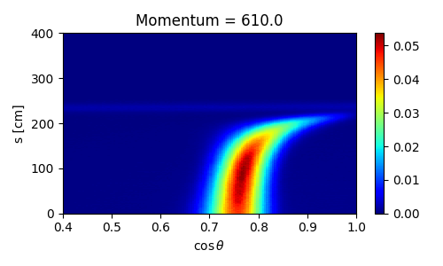

Numbers of photons seems consistent with the cherenkov profiles

Electrons

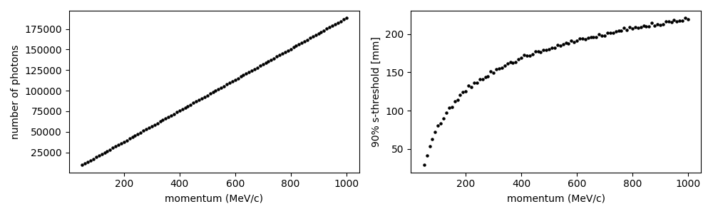

Mu-

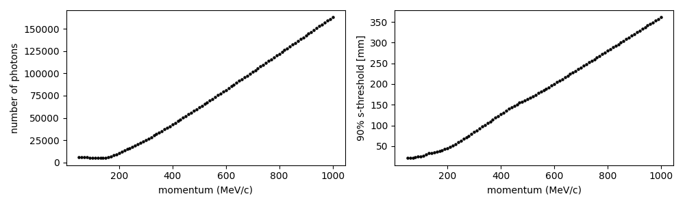

### Integrate profiles

```bash
cd /sps/t2k/mguigue/CProfiles/out/e-
python ../../../hk_software/WCSimFQTuningTools/CProfiles/integrate_cprofiles.py 400 150 30 -i cprofiles_e-_merged.root -v
cd ../mu-
python ../../../hk_software/WCSimFQTuningTools/CProfiles/integrate_cprofiles.py 400 150 30 -i cprofiles_mu-_merged.root -v
```

150 bins in cos theta and 30 in distance

### Fit profiles

```bash
cd /sps/t2k/mguigue/CProfiles/out/e-
python ../../../hk_software/WCSimFQTuningTools/CProfiles/fit_cprofile_integrals.py 3 -i cprofiles_integrals.root -v
cd /sps/t2k/mguigue/CProfiles/out/mu-
python ../../../hk_software/WCSimFQTuningTools/CProfiles/fit_cprofile_integrals.py 3 -i cprofiles_integrals.root -v
```

## Charge profiles

Change the config file to

```julia
    	 prod_basedir = "$(ENV["HOME"])/mysps/ChargePDF/e-"

       verbose           = true
       nevents_per_task  = 50
       nsubtasks         = 100
       ntasks_per_job    = 10
       # Cherenkov profile
#        base_mac          = abspath("templates/cprofile_base.mac")
#        config_mac        = abspath("templates/cprofile_config.mac")
       # charge PDF
       base_mac          = abspath("templates/charge_base.mac")
       config_mac        = abspath("templates/charge_config.mac")
       task_template     = abspath("templates/task_template.sh")
       job_template      = abspath("templates/job_template.sh")

			 config_variables = Dict( "true_charge" => vcat( range(0.1, 1.9, step=0.1)
                                                     , range(2.0, 4.5, step=0.5)
                                                     , range(5.0, 9.0, step=1)
                                                     , range(  10, 19, step=2)
                                                     , range(  20, 50, step=5)))
```

Change charge_base.mac file to point to HK geometry

```bash
/WCSim/WCgeom HyperK_HybridmPMT_IDonly_Realistic # as of WCSim 1.12.6 (ID only, no OD)
```

I also commented out some other lines, but I am not sure this will work…

Then run the julia scripts

Fixes:

- Copy HK mPMT configuration file related to HK geometry (`*HyperK_HybridmPMT_IDonly_Realistic`)*: `mPMTconfig_19_nuPrism_3ring.txt`
- Commented out line 386 of [WCSimEventAction.cc](http://WCSimEventAction.cc) (too much verbosity) → recompile WCSim and WCSimFQTuner

### Create 2D histos

```bash
cd /sps/t2k/mguigue/ChargePDF
python ../hk_software/WCSimFQTuningTools/Charge/create_2Dhistos_and_unhitP_parallel.py -v --qbins ../hk_software/WCSimFQTuningTools/Charge/qbins_wcte.txt --wcsimlib ../hk_software/WCSim/install-Linux_x86_64-gcc_8-python_3.10.13/lib out -j4
```

Unclear about the qbins_wcte.txt file: the true charge goes up to 50, but the qbins of wcte goes up to 200?

[charge2D.pdf](charge2D.pdf)

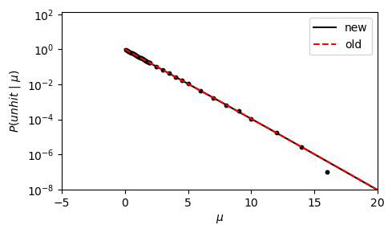

Above: Old version for WCTE; below: for HK

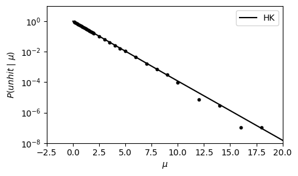

### Fit

```bash
python ../hk_software/WCSimFQTuningTools/Charge/fit_charge_pdfs.py -v --infile charge2D_and_unhit.root --npars 5 6 --qranges 0 10 20
```

Seems like the double range with different parameter doesn’t work well; switching to a single parameter range…

```bash
python ../hk_software/WCSimFQTuningTools/Charge/fit_charge_pdfs.py -v --infile charge2D_and_unhit.root --npars 5 --qranges 0 1000
```

[chargePDF0_30.pdf](chargePDF0_30.pdf)

Looks a bit odd…

Gonzalo opened an issue (https://github.com/gondiaz/WCSimFQTuningTools/issues/3). 

The other traces look reasonable, even if the chosen range is not optimal…

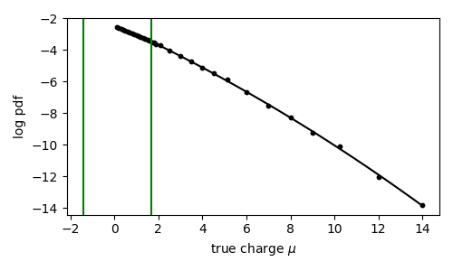

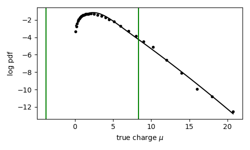

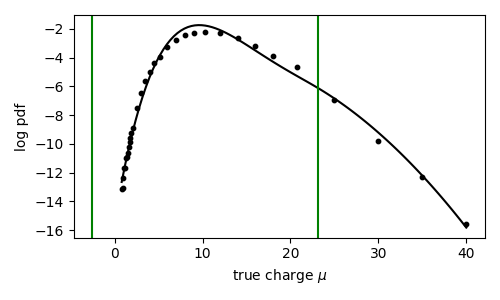

## Scatering tables

Change the simulation config file to

```julia
    	 prod_basedir = "$(ENV["HOME"])/mysps/ScatteringTable"

verbose           = true
#        nevents_per_task  = 5 -> specified in each tuning step
       nsubtasks         = 100
       ntasks_per_job    = 4

# Scattering tables
       nevents_per_task  = 200000
       base_mac          = abspath("templates/stable_base_hk.mac")
       config_mac        = abspath("templates/stable_config.mac")

       task_template     = abspath("templates/task_template.sh")
       job_template      = abspath("templates/job_template.sh")

```

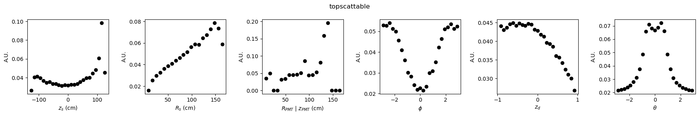

for WCTE

### Compute table

```bash
cd /sps/t2k/mguigue/hk_software/WCSimFQTuningTools/STable
python compute_STable.py /sps/t2k/mguigue/ScatteringTable/out --nbins 20 20 20 20 20 20 20 --zedge 3237.55 --redge 3190 --vaxis 2 --wcsimlib /sps/t2k/mguigue/hk_software/WCSim/install-Linux_x86_64-gcc_8-python_3.10.13/lib --fitqun /sps/t2k/mguigue/hk_software/fiTQun/install-Linux_x86_64-gcc_8-python_3.10.13/lib  -v
mv scattables.root /sps/t2k/mguigue/ScatteringTable/ # as they are created in /sps/t2k/mguigue/hk_software/WCSimFQTuningTools/STable
cd Analysis
python stable.py
```

Put 3237.55  which is `3287.55` (HK half height in cm - 50 cm) for zedge and `3190` for redge

Put vaxis 2 (as cyclinder axis is on z axis)

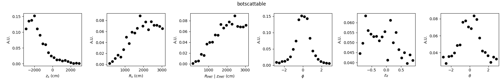

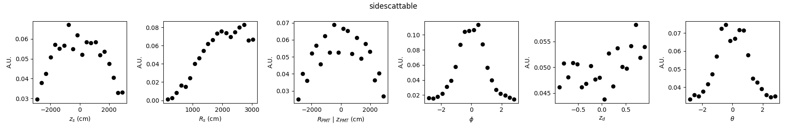

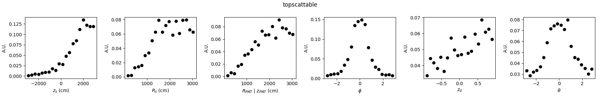

Looks reasonable: 

- The angular distribution should be symmetrical; but not sure about the U vs n shape of the phi distribution

## Angular PDF

No need for simulation since we are reusing the STable simulation

### Compute angular response

```bash
python compute_angular_responses.py -v --nbins 20 30 --vaxis 2 --zedge 3237.55 --redge 3190 --wcsimlib /sps/t2k/mguigue/hk_software/WCSim/install-Linux_x86_64-gcc_8-python_3.10.13/lib /sps/t2k/mguigue/ScatteringTable/out
```

### Fit angular response

```bash
python fit_angular_response.py -v -i angular.root 5 --lims 40 100
```